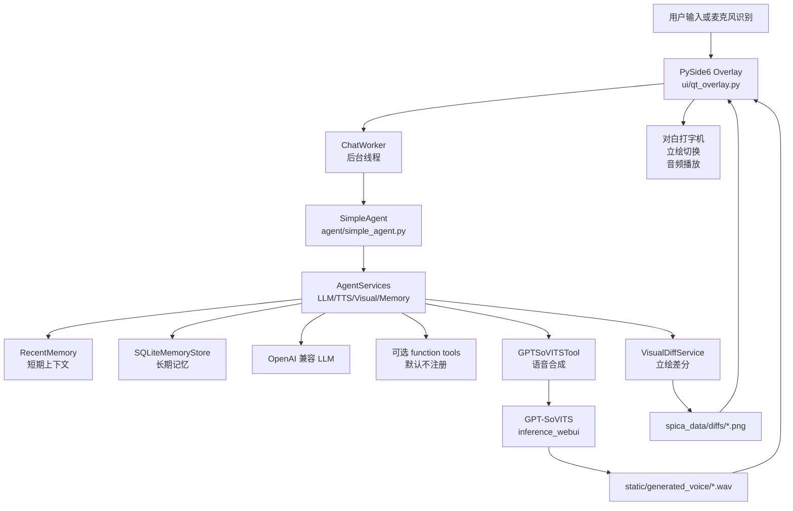
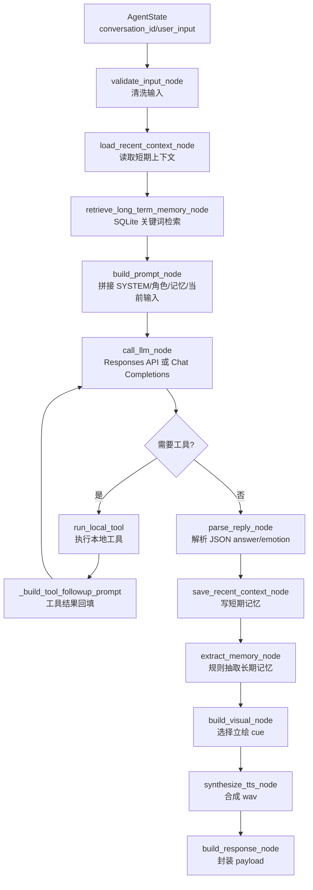
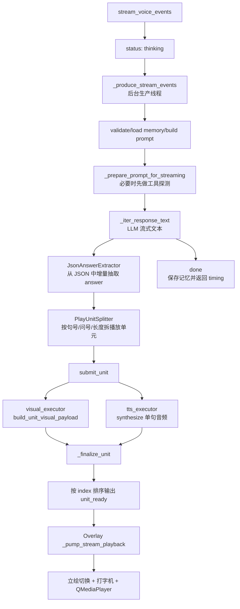
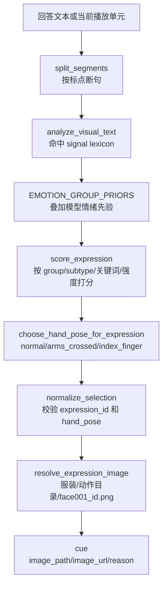
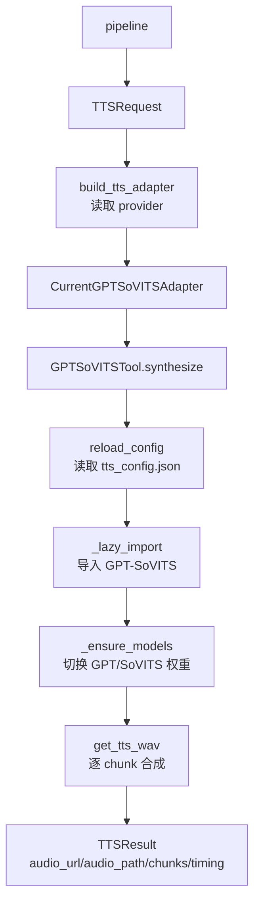

# Spica Chatbot

Spica Chatbot 是一个本地桌面 Galgame 风格语音聊天应用。它用 PySide6 做透明悬浮窗口，用 OpenAI 兼容接口生成日语角色回复，再把回复拆成可播放片段，驱动立绘差分选择和 GPT-SoVITS 语音合成。

当前默认入口是桌面悬浮 UI：`webui_qt.py` -> `ui/qt_overlay.py`。UI 内部已拆分为 controllers、workers、models 和 widgets，聊天、点歌、语音输入、音频播放和打字机效果分别由独立模块维护。

## 功能概览

- 透明置顶桌面 Overlay，包含立绘、对白框、输入框、窗口控制和设置面板。
- OpenAI 兼容 LLM 客户端，支持标准 Responses API，并对 DeepSeek 这类 Chat Completions 兼容客户端做降级适配。
- 短期上下文记忆和 SQLite 长期记忆。
- 可选 LLM function tool 基础设施；默认不注册本地 demo 工具。
- 流式生成播放：LLM 增量文本 -> 断句播放单元 -> 并行立绘选择和 TTS -> 按顺序播放。
- GPT-SoVITS 本地日语语音合成，按情绪选择参考音频。
- 本地投票式立绘差分选择，支持 8 套服装、3 类手部动作、27 个表情编号。
- 点歌/翻唱链路：网易云搜索与下载 -> 人声分离 -> RVC/Applio 变声 -> 混音输出。
- 可选中文麦克风识别，支持 ReSpeaker USB 4 Mic Array 硬件 VAD，依赖 `speech_recognition`、`PyAudio` 和设备后端。

## 目录结构

```text
Spica-Chatbot/
├── webui_qt.py                    # 桌面入口，处理 Linux Qt 依赖、输入法环境和 Overlay 启动
├── build_release.sh               # 生成发布目录，排除缓存/密钥/运行产物并保留必要骨架
├── run_ibus.sh                    # Linux ibus 输入法启动脚本
├── pytest.ini                     # pytest 配置
├── ui/
│   ├── qt_overlay.py              # PySide6 透明 Overlay 主窗口和模块装配
│   ├── overlay_config.py          # Overlay 配置加载和默认值
│   ├── overlay_config.json        # Overlay 外观、布局和运行配置
│   ├── controllers/               # 交互控制层：聊天流、音频、点歌、语音输入、打字机
│   ├── workers/                   # Qt 后台线程：聊天、点歌、启动预热
│   ├── models/                    # UI 状态模型：播放 token、流式单元、点歌状态
│   └── widgets/                   # 对白框、输入面板、设置面板、窗口控制、图标等组件
├── agent/
│   ├── simple_agent.py            # SimpleAgent 门面，组装 LLM、记忆、TTS、立绘服务
│   ├── runtime.py                 # 同步 voice pipeline 编排
│   ├── nodes.py                   # 同步 pipeline 节点：prompt、LLM、记忆、立绘、TTS、响应
│   ├── streaming_pipeline.py      # 流式生成、断句、并行 TTS/立绘、事件输出
│   ├── state.py                   # AgentState / AgentServices 数据结构
│   ├── prompt_builder.py          # Spica 角色 prompt 构建
│   ├── reply_parser.py            # 模型 JSON 回复解析和情绪归一化
│   ├── text_normalizer.py         # TTS/播放前的文本清洗
│   └── character_loader.py        # 角色卡和对话者设定加载
├── memory/
│   ├── store.py                   # SQLite 长期记忆
│   ├── recent.py                  # 内存短期对话上下文
│   ├── extractor.py               # 从用户输入抽取可保存记忆
│   └── control.py                 # 记忆保存、去重、裁剪控制
├── agent_tools/
│   ├── function_tools/
│   │   ├── __init__.py            # 可选 function tool 空默认注册表和通用执行器
│   │   └── song/
│   │       ├── intent*.py         # 点歌/暂停/继续/取消等意图识别与规则路由
│   │       ├── netease.py         # 网易云音乐搜索、音频地址解析和下载
│   │       ├── separator.py       # 人声/伴奏分离封装
│   │       ├── rvc.py             # Applio/RVC 推理封装
│   │       ├── mixer.py           # 人声、伴奏裁剪和混音
│   │       ├── pipeline.py        # 点歌翻唱完整流水线
│   │       ├── models.py          # SongRequest / SongJobResult / 状态模型
│   │       └── song_config.json   # 点歌、缓存、分离、RVC、混音配置
│   ├── tts/
│   │   ├── base.py                # TTSAdapter 协议
│   │   ├── schemas.py             # TTSRequest / TTSResult
│   │   ├── manager.py             # 根据配置构建 TTS adapter
│   │   ├── adapters/              # 前端适配层：current GPT-SoVITS / dummy
│   │   ├── gptsovits/
│   │   │   └── service.py         # GPT-SoVITS 后端封装、切句、写 wav、模型预热
│   │   └── vendors/
│   │       └── GPT-SoVITS-v2pro-20250604-nvidia50/ # 上游语音引擎占位目录
│   └── visual/
│       └── diff_service.py        # 立绘差分选择、服装选择、图片路径解析
├── hardware/
│   └── respeaker/                 # ReSpeaker USB 4 Mic Array 音频采集、灯光控制、硬件 VAD
├── common/
│   └── timing.py                  # 通用计时日志
├── examples/
│   └── llm_demo.py                # 命令行记忆示例
├── config/
│   ├── tts_config.json            # GPT-SoVITS 路径、参考音频、合成参数
│   └── visual_config.json         # 差分根目录、对白框、服装和选择策略
├── docs/
│   ├── dev_smoke_tests.md         # 开发期 smoke test 说明
│   └── manual_smoke_checklist.md  # 手动验收清单
├── spica_data/                    # 角色卡、语音参考、立绘差分和本地运行数据
│   ├── Spica_skill/               # 角色卡：SKILL.md/self.md/persona.md/meta.json
│   ├── voice/                     # TTS 情绪参考音频和 prompt
│   ├── diffs/                     # 立绘差分、差分规则、UI 贴图
│   ├── manifest.tsv               # 素材清单
│   └── memory.sqlite3             # SQLite 长期记忆，运行时生成或更新
├── static/
│   ├── generated_voice/           # GPT-SoVITS 对话语音输出，运行时生成
│   └── generated_song/            # 点歌/翻唱缓存、临时文件和最终音频，运行时生成
├── tests/                         # 单元测试和流水线 smoke test
├── third_party/
│   └── respeaker_usb_4_mic_array/ # ReSpeaker 调参工具第三方代码
└── xiaosan.env                    # 本地环境变量模板/配置，真实密钥不要提交
```

## 快速启动

1. 准备 GPT-SoVITS。

   发布包里的 `agent_tools/tts/vendors/GPT-SoVITS-v2pro-20250604-nvidia50/` 是空占位目录，不包含上游 GPT-SoVITS 代码、虚拟环境、模型权重或运行产物。使用前需要把匹配的 GPT-SoVITS v2Pro / nvidia50 版本解压或克隆到这个目录，完成后应至少能看到：

   ```text
   agent_tools/tts/vendors/GPT-SoVITS-v2pro-20250604-nvidia50/
   ├── requirements.txt
   ├── GPT_SoVITS/inference_webui.py
   ├── GPT_weights_v2ProPlus/
   └── SoVITS_weights_v2ProPlus/
   ```

   默认 `config/tts_config.json` 指向：

   - `agent_tools/tts/vendors/GPT-SoVITS-v2pro-20250604-nvidia50/GPT_weights_v2ProPlus/spcia-e25.ckpt`
   - `agent_tools/tts/vendors/GPT-SoVITS-v2pro-20250604-nvidia50/SoVITS_weights_v2ProPlus/spcia_e12_s1932.pth`

   如果你的目录名、权重文件名或版本不同，修改 `config/tts_config.json` 里的 `gptsovits_root`、`gpt_model_path` 和 `sovits_model_path`。

2. 准备 `spica_data` 素材目录。

   发布包里的 `spica_data/` 只保留空目录和空子目录，不包含角色卡、立绘差分、参考音频、SQLite 记忆库或生成音频。需要按下面约定补齐：

   - `spica_data/Spica_skill/`：放入 `SKILL.md`、`self.md`、`persona.md`、`meta.json`；也可以用 `SPICA_SKILL_DIR` 或 `SPICA_CHARACTER_PROFILE` 指向其他角色设定。
   - `spica_data/voice/{happy,angry,sad,surprised}/`：每个情绪目录放 `prompt.txt` 和 `config/tts_config.json` 中配置的参考 wav；`refs/` 目录放入 GPT-SoVITS 需要的补充参考音频。
   - `spica_data/diffs/`：放入 `expression_hand_pose_rules.json`、`preview_png.png`、`ui/_mw_filter01.png`，以及各服装目录和表情 PNG；路径需与 `config/visual_config.json` 保持一致。
   - `spica_data/memory.sqlite3` 不需要手动创建，运行时会自动生成或迁移。

3. 准备 Python 环境。

   项目当前脚本示例使用 `/home/san/anaconda3/envs/gptsovits/bin/python3.11`。如果新建环境，建议 Python 3.10 或 3.11，并安装 GPT-SoVITS 所需依赖。

   ```bash
   cd /home/san/ai_code/Spica-Chatbot
   pip install openai httpx python-dotenv PySide6 soundfile numpy pytest mss Pillow
   pip install -r requirements-screen.txt
   pip install -r agent_tools/tts/vendors/GPT-SoVITS-v2pro-20250604-nvidia50/requirements.txt
   ```

   可选语音输入：

   ```bash
   pip install SpeechRecognition PyAudio
   ```

4. 创建 `xiaosan.env`。

   发布包中的 `xiaosan.env` 会保留变量名并清空 `=` 后面的值。使用前填入自己的 OpenAI 兼容接口配置，不要提交真实密钥。

   ```env
   OPENAI_API_KEY=你的密钥
   OPENAI_BASE_URL=https://api.openai.com/v1
   MODEL=gpt-4.1-mini
   ```

   可选环境变量：

   | 变量 | 默认值 | 作用 |
   | --- | --- | --- |
   | `RECENT_MEMORY_TURNS` | `3` | 内存短期记忆保留轮数 |
   | `RECENT_CONTEXT_LIMIT` | `3` | 每次 prompt 注入的短期上下文轮数 |
   | `LONG_TERM_MEMORY_LIMIT` | `5` | SQLite 长期记忆检索条数 |
   | `LONG_TERM_MEMORY_BUDGET_CHARS` | `1200` | 每次 prompt 注入的长期记忆字符预算 |
   | `RECENT_TURN_CHAR_LIMIT` | `360` | 单轮短期上下文注入字符上限 |
   | `MAX_LONG_TERM_MEMORIES` | `200` | 单个 conversation 保留的长期记忆上限 |
   | `MAX_TOOL_ROUNDS` | `3` | LLM 工具调用最大轮数 |
   | `SPICA_SKILL_DIR` | `spica_data/Spica_skill` | 默认角色卡目录 |
   | `SPICA_USER_NAME` | `麦` | 默认对话者名称，会映射原角色卡中的速川麦/麦 |
   | `SPICA_CHARACTER_PROFILE` | 读取默认角色卡 | 覆盖角色设定 |
   | `PLAY_UNIT_MIN_CHARS` | `18` | 流式播放单元最小长度 |
   | `PLAY_UNIT_MAX_CHARS` | `96` | 流式播放单元最大长度 |
   | `VISUAL_STREAM_WORKERS` | `2` | 流式立绘选择线程数 |
   | `SPICA_SCREEN_ENABLED` | `true` | 是否启用本地 screen pipeline |
   | `SPICA_SCREEN_PROVIDER` | `moondream_local` | 本地 screen pipeline provider |
   | `SPICA_SCREEN_MODEL_ID` | `vikhyatk/moondream2` | 本地 Moondream 模型 ID |
   | `SPICA_SCREEN_REVISION` | `2025-06-21` | 本地 Moondream revision |
   | `SPICA_SCREEN_DEVICE` | `cuda` | 本地推理设备 |
   | `SPICA_SCREEN_DTYPE` | `bfloat16` | 本地推理 dtype；4090 默认优先 `bfloat16`，兼容性需要时可设 `auto` |
   | `SPICA_SCREEN_MAX_SIDE` | `768` | 本地 screen 分析输入最长边 |
   | `SPICA_SCREEN_REASONING` | `false` | 是否启用额外推理提示 |
   | `SPICA_SCREEN_PRELOAD` | `false` | 启动时是否预加载本地 screen 模型 |
   | `SPICA_SCREEN_OCR_ENABLED` | `true` | 是否启用本地 OCR |
   | `SPICA_SCREEN_OCR_ENGINE` | `rapidocr` | 本地 OCR 引擎 |
   | `SPICA_SCREEN_CAPTURE_FORMAT` | `png` | screen pipeline 内部截图格式 |
   | `SPICA_SCREEN_INFER_TIMEOUT_SEC` | `30` | 本地 screen 分析超时 |
   | `SPICA_SCREEN_LOG_TIMING` | `true` | 是否记录 screen 阶段耗时 |
   | `SPICA_SCREEN_DEBUG_SAVE` | `false` | 显式开启时保存调试截图；默认不落盘 |

   Screen observation 使用本地配置 `config/screen_vision_config.json`，流程为本地截图、本地 RapidOCR 文字读取、本地 Moondream 屏幕理解，不上传图片。自然语言明确要求查看屏幕/桌面/显示器/画面时触发 `inspect_screen`，只做一次 `target=full_screen` 的自动主屏幕截图；截图按钮使用手动选区并随下一条消息发送，走 `mode=region` / `source=manual_region_selection`，不会再次自动截图，也不会把原始图片注入主聊天模型。

5. 启动桌面 Overlay。

   ```bash
   /home/san/anaconda3/envs/gptsovits/bin/python webui_qt.py
   ```

   Linux ibus 环境可以使用：

   ```bash
   ./run_ibus.sh
   ```

6. 命令行记忆测试。

   ```bash
   python examples/llm_demo.py
   ```

7. 运行测试。

   ```bash
   python -m pytest tests
   ```

   不建议直接在仓库根目录运行无参数 `pytest`，因为它可能递归扫描内置 `agent_tools/tts/vendors/GPT-SoVITS-v2pro-20250604-nvidia50/runtime/` 里的第三方包。

## 配置说明

### 角色卡与对话对象

默认启动时，`agent/simple_agent.py` 会读取 `spica_data/Spica_skill/` 下的 `SKILL.md`、`self.md`、`persona.md` 和 `meta.json`，作为 Spica 的角色卡注入 prompt。

Prompt 还会额外注入固定对话对象设定：当前输入始终视为 `SPICA_USER_NAME` 指定的人说的话，默认是 `麦`。角色卡里原本属于速川麦/麦的恋爱、同居、家人、重逢等人物事迹会在运行时映射成当前对话者名称；小麦、麦田、麦畑等普通词不会被替换。

桌面 Overlay 的设置面板里也可以临时编辑用户名。长期记忆只补充当前用户名的偏好、两人的相处细节或项目设置，不能覆盖角色卡和当前用户名的身份。

### 记忆控制

长期记忆写入路径现在统一为：规则抽取候选记忆 -> 过滤覆盖系统/角色卡的危险记忆 -> 按语义 key upsert 去重 -> 必要时按重要度裁剪。同步回复和流式回复共用同一套逻辑。

SQLite 记忆表会自动迁移新增字段：`memory_key`、`memory_type`、`source`、`confidence`、`pinned`、`status`。旧数据库可以直接继续使用。

### TTS 配置

`config/tts_config.json` 控制 GPT-SoVITS 的路径、模型权重、输出目录、预热策略和情绪参考音频。

关键字段：

- `provider`：TTS provider，默认 `gptsovits_current`；测试可切到 `dummy`。
- `gptsovits_root`：内置 GPT-SoVITS 根目录。
- `gpt_model_path` / `sovits_model_path`：默认 GPT 和 SoVITS 权重。
- `output_dir`：wav 输出目录，默认 `static/generated_voice`。
- `warmup_on_startup`：Overlay 启动后是否预热模型。
- `tts_params.sentence_chunking`：是否把长文本切成多个 TTS chunk。
- `emotions`：`happy`、`angry`、`sad`、`surprised` 的参考音频和 prompt。

### 立绘配置

`config/visual_config.json` 控制差分素材、服装、对白框和角色布局。

关键字段：

- `diff_root`：差分根目录，默认 `spica_data/diffs`。
- `rules_path`：表情和手部动作规则 JSON。
- `costume_mode`：`random` 或 `fixed`。
- `selected_costume`：固定服装模式下使用的服装。
- `segments`：非流式回答的断句和合并策略。
- `selection`：差分平滑策略。
- `dialog`：对白框颜色、滤镜、说话人名称。
- `character`：默认表情、默认手部动作、角色显示位置。

## 整体架构图



## 同步流水线逻辑图

`SimpleAgent.run_voice()` 使用 `runtime.run_voice_pipeline()`，适合一次性返回完整结果。



## 流式播放局部架构图

Overlay 默认使用 `SimpleAgent.stream_voice()`。它不会把 token 直接交给 UI，而是等到形成可播放句段后再输出 `unit_ready`。



事件类型：

| 事件 | 说明 |
| --- | --- |
| `status` | 当前状态，例如 thinking 或 tools |
| `unit_ready` | 一个可播放单元，包含文本、音频路径、立绘 cue、耗时 |
| `done` | 完整回答、最终情绪、总单元数和 timing |
| `error` | 流水线异常 |

## 立绘选择局部架构图

立绘选择完全在本地完成，不调用模型。核心入口是 `VisualDiffService.build_visual_payload()` 和 `build_unit_visual_payload()`。



差分素材当前约定：

- 服装目录：`spica_data/diffs/<服装名>/`
- 手部动作目录：`抱肩`、`普通动作`、`竖食指`
- 表情文件名匹配：`*face001_<id>.png`
- 规则文件：`spica_data/diffs/expression_hand_pose_rules.json`

## TTS 局部架构图

TTS 分成两层：`TTSAdapter` 是前端协议，pipeline 只依赖 `TTSRequest` / `TTSResult`；`GPTSoVITSTool` 是当前 GPT-SoVITS 后端实现，由 `CurrentGPTSoVITSAdapter` 包装后接入 pipeline。



集成的上游入口：

- `change_gpt_weights(gpt_path=...)`
- `change_sovits_weights(sovits_path=..., prompt_language=..., text_language=...)`
- `get_tts_wav(...)`

## 主要模块职责

| 文件 | 职责 |
| --- | --- |
| `webui_qt.py` | 启动前检查 Linux `libxcb-cursor.so.0`，处理 Qt 输入法兼容，然后进入 Overlay |
| `ui/qt_overlay.py` | 装配 Overlay 主窗口、配置、控制器、后台 worker 和基础窗口事件 |
| `ui/controllers/chat_stream_controller.py` | 消费 `stream_voice()` 事件，管理播放单元、停止/取消和流式聊天状态 |
| `ui/controllers/audio_controller.py` | 封装 QMediaPlayer 播放、音频归属 token 和停止策略 |
| `ui/controllers/song_controller.py` | 点歌/翻唱 UI 状态机，处理准备、暂停、继续、取消和最终播放 |
| `ui/controllers/voice_input_controller.py` | 连接麦克风按钮、语音识别 worker 和输入框提交 |
| `ui/widgets/` | 对白框、输入栏、设置面板、窗口控制、图标和 resize handle |
| `agent/simple_agent.py` | 读取环境变量，初始化 OpenAI 客户端、记忆、工具，向 UI 暴露同步和流式接口 |
| `agent/runtime.py` / `agent/nodes.py` | 同步链路编排和每个处理节点 |
| `agent/streaming_pipeline.py` | 流式 LLM、JSON answer 增量抽取、播放单元拆分、并行 TTS/立绘、事件队列 |
| `agent/prompt_builder.py` | 构造 Spica 系统提示词，要求模型输出 JSON |
| `agent/reply_parser.py` | 解析模型 JSON，失败时用启发式情绪兜底 |
| `agent/text_normalizer.py` | 清洗朗读文本，减少符号、Markdown 和不适合 TTS 的片段 |
| `memory/store.py` | SQLite 长期记忆表、关键词检索、use_count 更新 |
| `memory/recent.py` | 每个 conversation_id 的最近 N 轮对话 |
| `memory/extractor.py` | 用规则识别“记住、我喜欢、叫我”等可保存事实 |
| `agent_tools/function_tools/__init__.py` | 可选 LLM function tool 空默认注册表和通用执行器 |
| `agent_tools/function_tools/song/intent_router.py` | 点歌、暂停、继续、取消等自然语言意图路由 |
| `agent_tools/function_tools/song/pipeline.py` | 搜歌、下载、分离、RVC、混音和缓存复用的完整点歌流水线 |
| `agent_tools/function_tools/song/netease.py` | 网易云音乐搜索、音频 URL 解析和下载 |
| `agent_tools/function_tools/song/separator.py` / `rvc.py` / `mixer.py` | 分离伴奏、人声变声、裁剪和混音封装 |
| `agent_tools/visual/diff_service.py` | 本地投票式表情和手部动作选择，解析差分图片 |
| `agent_tools/tts/base.py` / `schemas.py` | TTS 前端协议和标准请求/返回结构 |
| `agent_tools/tts/manager.py` / `adapters/` | 根据配置选择 TTS provider，并适配同步/流式 pipeline |
| `agent_tools/tts/gptsovits/service.py` | GPT-SoVITS 后端模型加载、情绪参考音频选择、切句和 wav 输出 |
| `hardware/respeaker/audio.py` / `speech_worker.py` | ReSpeaker 硬件 VAD 录音和中文语音识别 worker |
| `hardware/respeaker/control.py` | ReSpeaker 灯光/硬件控制封装 |
| `docs/dev_smoke_tests.md` / `docs/manual_smoke_checklist.md` | 开发期 smoke test 和手动验收记录 |

## 数据和运行产物

- `spica_data/memory.sqlite3`：长期记忆数据库，运行时更新。
- `static/generated_voice/*.wav`：语音输出，运行时生成。
- `static/generated_song/cache/`：点歌/翻唱缓存，包含原曲、分离人声/伴奏、RVC 人声、最终混音和元数据。
- `static/generated_song/tmp/`：点歌流水线临时目录，异常退出后可安全清理。
- `spica_data/diffs/`：立绘差分素材和规则，不是运行缓存；发布包只保留空目录骨架。
- `agent_tools/tts/vendors/GPT-SoVITS-v2pro-20250604-nvidia50/`：发布包只保留空目录，占位给用户放入上游语音引擎、依赖和权重。
- `xiaosan.env`：本地密钥配置；发布包只保留空值模板，不应提交真实密钥。

`.gitignore` 已忽略 Python 缓存、环境文件、生成语音和 SQLite 运行数据库。

## 测试覆盖

测试重点在无真实 LLM/TTS 的情况下验证核心逻辑：

- `tests/test_memory_store.py`：SQLite 记忆新增、检索、清空。
- `tests/test_prompt_builder.py`：prompt 分区和记忆抽取。
- `tests/test_recent_memory.py`：短期记忆只保留最近轮次。
- `tests/test_pipeline_smoke.py`：同步 pipeline、默认无 demo 工具、DeepSeek Chat Completions 兼容。
- `tests/test_streaming_pipeline.py`：流式事件顺序、句段拆分、TTS 文本清洗、DeepSeek 流式兼容。
- `tests/test_tts_adapters.py`：TTS adapter 请求/返回映射和失败兜底。
- `tests/test_visual_classifier.py`：本地立绘分类器对说明、不满、悲伤语气的选择。
- `tests/test_chat_stream_controller_units.py`：UI 流式播放单元控制器的排队、停止和收尾行为。
- `tests/test_song_intent_router.py` / `tests/test_song_trigger.py`：点歌意图路由、触发词、暂停/继续/取消等控制语句。

## 开发注意事项

- LLM 最终输出必须是 JSON：`answer`、`emotion`、`emotion_reason`。
- `answer` 应是适合直接朗读的自然日语，避免长公式和难读符号。
- 流式链路只播放完整单元，不播放裸 token。
- `agent_tools/visual/diff_service.py` 的 `image_url` 主要服务旧 Web UI；桌面 Overlay 使用 `image_path` 直接加载本地图片。
- `agent_tools/tts/vendors/GPT-SoVITS-v2pro-20250604-nvidia50/` 是上游语音引擎和权重目录，业务层只应通过 `agent_tools/tts/gptsovits/service.py` 访问。
- `agent_tools/function_tools/song/Applio/` 是点歌 RVC 依赖的上游 Applio 目录，业务层只应通过 `song/rvc.py` 和 `song/pipeline.py` 访问。

## 发布打包

运行下面命令会在本项目上一层生成 `Spica-Chatbot_release/`：

```bash
bash build_release.sh
```

脚本会复制项目代码和配置，排除 `.git`、IDE 配置、缓存、SQLite、生成 wav、原始 `spica_data` 文件和完整 GPT-SoVITS 目录；然后重新创建空的 `agent_tools/tts/vendors/GPT-SoVITS-v2pro-20250604-nvidia50/`、空的 `spica_data/` 子目录骨架，并生成 `=` 后为空的 `xiaosan.env`。如果用 Git 推送 release 目录，注意 Git 本身不会记录真正的空目录，需要按 README 重新创建这些目录或自行添加占位文件。
