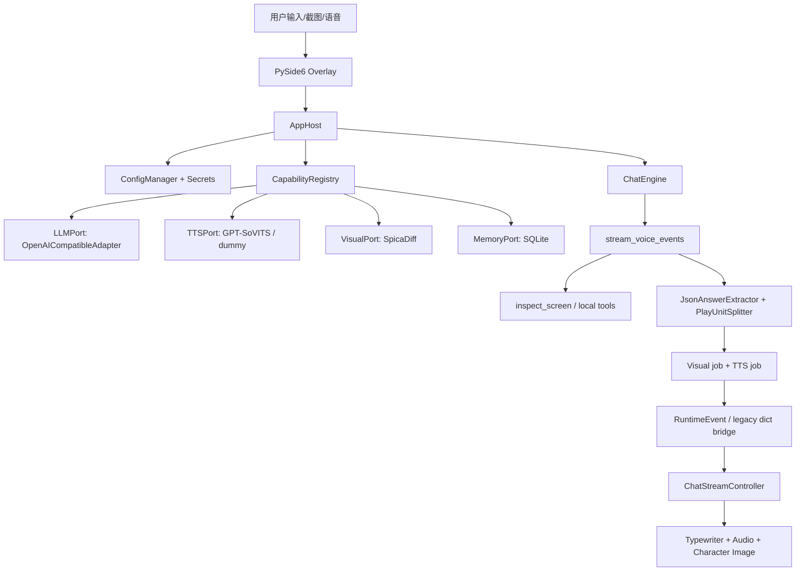

# Spica Chatbot

Spica Chatbot 是一个本地桌面 Galgame 风格语音聊天应用。它用 PySide6 提供透明置顶 Overlay，用 OpenAI 兼容接口生成角色回复，并把回复拆成可播放单元，驱动本地立绘差分、GPT-SoVITS 语音合成、短期/长期记忆、屏幕观察、点歌翻唱和可选语音输入。

当前代码已经完成平台化重构的主要骨架：UI 不再直接组装 LLM/TTS/Visual/Memory 服务，后端由 `AppHost` 统一装配，核心对话由 `ChatEngine` 驱动，能力通过 ports/adapters 和 `CapabilityRegistry` 注册，跨 Host 到 UI 的运行事件用 `RuntimeEvent` dataclass 表达。

## 当前状态

- 桌面入口：`webui_qt.py` -> `ui/qt_overlay.py`。
- 组装根：`spica.host.app_host.AppHost.initialize()`。
- 对话核心：`spica.core.chat_engine.ChatEngine`。
- 流式运行时：`spica.runtime.orchestrator.stream_voice_events()`。
- 配置入口：`spica.config.manager.ConfigManager` + `data/config/*.yaml` + `xiaosan.env`。
- 能力注册：`spica.plugins.registry.CapabilityRegistry`。
- 角色包：`spica.core.character.CharacterPackage`，默认使用 `spica_data/Spica_skill`。
- UI 状态：`spica.core.state_machine.ChatStateMachine` 驱动忙碌、生成、播放、暂停和错误状态。

## 功能

- PySide6 透明置顶桌面 Overlay，包含立绘、对白框、输入框、截图按钮、语音按钮、窗口控制和设置面板。
- OpenAI 兼容 LLM adapter，支持 Responses API，并对 DeepSeek 这类 Chat Completions 兼容客户端做分支适配。
- 流式生成播放：LLM delta -> JSON answer 提取 -> 播放单元切分 -> 并行立绘选择和 TTS -> 按 index 顺序播放。
- GPT-SoVITS 本地日语 TTS，按情绪选择参考音频，支持启动预热。
- 本地立绘差分选择，基于回复文本和情绪投票选择表情、手势、服装、对白样式。
- RecentMemory 短期上下文和 SQLite 长期记忆，长期记忆通过 `MemoryPort` 按 `character_id::conversation_id` 隔离。
- 本地屏幕观察工具 `inspect_screen`，只有用户明确要求查看屏幕时触发，走本地截图、RapidOCR 和 Moondream，不上传图片。
- 手动截图附件，用户框选区域后随下一条消息进入本地 screen pipeline。
- 点歌/翻唱链路：意图识别 -> 网易云搜索和下载 -> 人声分离 -> Applio/RVC 变声 -> 混音输出。
- 可选 ReSpeaker USB 4 Mic Array 语音输入，使用硬件 VAD 和 `speech_recognition` 中文识别。
- 插件入口：插件可注册 adapters/tools，当前阶段不开放 UI widget 插件。

## 架构



### 分层约束

`spica/` 是平台核心，不能 import PySide、PyQt、shiboken 或其他 GUI 库。这个约束由 `tests/test_layering.py` 守住。

业务代码不能直接读取 `os.getenv()` 或 `os.environ`。环境变量只能在 `spica/config/manager.py` 和 `spica/config/secrets.py` 读取，其他层必须通过 `AppConfig` 或 `Secrets` 获取配置。这个约束由 `tests/test_no_getenv.py` 守住。

Host 只做组装和窄接口转发，业务逻辑在 `ChatEngine`、runtime 组件、adapters、memory 和 tool 模块中。

### 主要目录

```text
.
├── webui_qt.py                         # 桌面启动入口，处理 Linux Qt/xcb/输入法/ALSA 环境
├── spica/
│   ├── host/                           # AppHost 组装根、backend assembly、ManagementSurface
│   ├── core/                           # ChatEngine、RuntimeEvent、ChatStateMachine、CharacterPackage
│   ├── runtime/                        # 流式编排、LLM stream、工具轮、播放单元、TTS/Visual job、memory commit
│   ├── ports/                          # LLM/TTS/Visual/Memory/Tool 协议
│   ├── adapters/                       # OpenAI 兼容 LLM、SQLite memory、GPT-SoVITS TTS、Spica visual adapter
│   ├── config/                         # Pydantic AppConfig、ConfigManager、Secrets
│   └── plugins/                        # CapabilityRegistry、PluginHost、plugin manifest
├── agent/                              # prompt、reply parser、同步节点、AgentState/AgentServices 兼容层
├── agent_tools/
│   ├── function_tools/screen/           # 本地截图、RapidOCR、Moondream screen pipeline
│   ├── function_tools/song/             # 点歌意图、网易云、分离、RVC、混音 pipeline
│   ├── tts/                             # TTSAdapter、GPT-SoVITS service、dummy adapter
│   └── visual/                          # VisualDiffService 本地立绘差分选择
├── memory/                             # RecentMemory、SQLiteMemoryStore、规则记忆抽取和去重
├── hardware/respeaker/                 # ReSpeaker 录音、USB control、Qt speech worker
├── ui/                                 # PySide6 UI、controllers、workers、models、widgets
├── data/config/                        # TTS、visual、plugin YAML 配置
├── config/screen_vision_config.json     # 本地屏幕观察配置
├── spica_data/                         # 角色卡、立绘、参考音频、本地记忆数据，发布仓库不带大素材
├── static/generated_voice/             # 对话 TTS 输出，运行时生成
├── static/generated_song/              # 点歌翻唱缓存和输出，运行时生成
├── third_party/                        # 第三方硬件辅助代码，发布仓库不带
├── tests/                              # 单元测试、golden、层级守卫、adapter 合同测试
└── build_release.sh                    # 历史发布脚本，发布规则见本文后面的“发布规则”
```

## 快速启动

### 1. 准备 Python 环境

项目当前开发环境是 conda `gptsovits`，Python 3.10/3.11 均可。示例：

```bash
cd /home/san/ai_code/Spica-Chatbot
conda activate gptsovits
pip install openai httpx python-dotenv pydantic PyYAML PySide6 soundfile numpy pytest
pip install -r requirements-screen.txt
```

可选语音输入依赖：

```bash
pip install SpeechRecognition PyAudio pyusb
```

如果要运行 GPT-SoVITS，还需要按你的 GPT-SoVITS 版本安装其依赖。发布仓库不会包含 GPT-SoVITS vendor 目录内容。

### 2. 准备环境变量

在仓库根目录创建 `xiaosan.env`：

```env
OPENAI_API_KEY=你的密钥
OPENAI_BASE_URL=https://api.openai.com/v1
MODEL=gpt-4.1-mini
```

`OPENAI_API_KEY` 由 `spica.config.secrets.load_secrets()` 读取。`OPENAI_BASE_URL`、`MODEL` 和其他可调参数由 `ConfigManager` 映射到 `AppConfig`。

### 3. 准备 GPT-SoVITS

默认 TTS 配置在 `data/config/tts.yaml`，默认 vendor 根目录是：

```text
agent_tools/tts/vendors/GPT-SoVITS-v2pro-20250604-nvidia50
```

发布仓库里这个目录是空占位。使用前需要把匹配的 GPT-SoVITS v2Pro / nvidia50 版本放进去，并确认配置中的权重路径存在：

```text
GPT_weights_v2ProPlus/spcia-e25.ckpt
SoVITS_weights_v2ProPlus/spcia_e12_s1932.pth
```

如果你的模型文件名或目录不同，修改 `data/config/tts.yaml` 的：

- `gptsovits_root`
- `gpt_model_path`
- `sovits_model_path`
- `emotions.*.prompt_text_path`
- `emotions.*.ref_audio_path`
- `emotions.*.inp_refs_path`

### 4. 准备角色数据和素材

默认角色包目录是：

```text
spica_data/Spica_skill
```

需要包含：

```text
spica_data/Spica_skill/
├── meta.json
├── SKILL.md
├── self.md
└── persona.md
```

`meta.json` 支持字段：

```json
{
  "slug": "spica",
  "name": "辻倉朱比華",
  "char_name": "スピカ",
  "visual_config_path": null,
  "tts_config_path": null
}
```

`slug` 会作为 `character_id`，长期记忆会按角色隔离。`visual_config_path` 和 `tts_config_path` 可指向角色包内的专属配置；为空时使用 `data/config/visual.yaml` 和 `data/config/tts.yaml`。

立绘和语音素材默认从 `spica_data` 读取：

```text
spica_data/diffs/                         # 立绘差分、规则、UI 贴图
spica_data/voice/{happy,angry,sad,surprised}/
spica_data/memory.sqlite3                 # 运行时自动创建或迁移
```

发布仓库不会包含大体积 `spica_data` 素材，需要在本地补齐。

### 5. 启动 Overlay

```bash
python webui_qt.py
```

Linux ibus 环境可以用：

```bash
./run_ibus.sh
```

如果 Qt xcb 缺系统库，入口会提示安装 `libxcb-cursor0`。

### 6. 运行测试

只使用下面这条命令：

```bash
python -m pytest tests -q
```

不要在仓库根目录运行裸 `pytest`，它可能递归扫到 vendored GPT-SoVITS runtime，导致第三方包测试收集失败。

## 配置

### `data/config/tts.yaml`

控制 TTS provider、GPT-SoVITS 根目录、模型权重、输出目录、预热策略、情绪参考音频和切句参数。

常用字段：

- `provider`: 默认 `gptsovits_current`，测试可改为 `dummy`。
- `output_dir`: 默认 `../../static/generated_voice`。
- `warmup_on_startup`: 是否启动后预热。
- `warmup_emotion` / `warmup_emotions`: 预热情绪。
- `tts_params.sentence_chunking`: 长文本是否切分后送 TTS。
- `emotions`: `happy`、`angry`、`sad`、`surprised` 的 prompt 和参考音频。

### `data/config/visual.yaml`

控制本地立绘差分和 UI 演出素材。

常用字段：

- `diff_root`: 立绘差分根目录。
- `rules_path`: 表情和手势规则。
- `background_path`: 背景预览图。
- `costume_mode`: `random` 或 `fixed`。
- `selected_costume`: 固定服装模式使用的服装。
- `segments`: 非流式视觉 payload 的切段配置。
- `selection`: 差分平滑策略。
- `dialog`: 对白框 speaker、滤镜、颜色和透明度。
- `character`: 默认表情、默认手势、布局比例。

### `data/config/plugins.yaml`

插件 manifest。每个启用项会加载 `plugins/<name>/__init__.py` 并调用 `register(registry)`。

示例：

```yaml
plugins:
  - name: example_tts
    enabled: true
```

插件当前阶段只允许注册 adapters/tools，不开放 UI widget。

### `data/config/app.yaml`

这是 `ConfigManager` 的默认 typed config 文件路径。仓库可以没有该文件；没有时使用 `AppConfig` 默认值和环境变量覆盖。

可选示例：

```yaml
llm:
  provider: openai_compatible
  model: gpt-4.1-mini
  base_url: https://api.openai.com/v1
memory:
  provider: sqlite
  recent_memory_turns: 3
  recent_context_limit: 3
  long_term_memory_limit: 5
  long_term_memory_budget_chars: 1200
  recent_turn_char_limit: 360
  max_long_term_memories: 200
character:
  interlocutor_name: 麦
  package_dir: spica_data/Spica_skill
stream:
  play_unit_min_chars: 18
  play_unit_max_chars: 96
  visual_stream_workers: 2
max_tool_rounds: 3
```

### `config/screen_vision_config.json`

控制本地 screen pipeline：

- `provider`: 当前为 `moondream_local`。
- `device`: 当前设计为 `cuda`。
- `dtype`: 默认 `bfloat16`。
- `ocr_enabled`: 是否启用 RapidOCR。
- `debug_save_images`: 默认 `false`，不落盘调试截图。

### `ui/overlay_config.json`

控制桌面 Overlay 的角色缩放、UI 缩放、打字机速度和窗口初始比例。这是 UI 本地外观配置，不属于平台核心配置。

## 对话运行流程

### 同步路径

`ChatEngine.run_voice()` 构造 `AgentState`，调用 `agent.runtime.run_voice_pipeline()`，依次执行：

```text
validate_input
load_recent_context
retrieve_long_term_memory
analyze_screen_attachment
build_prompt
call_llm
parse_reply
save_stream_memory
build_visual
synthesize_tts
build_response
```

同步路径主要用于一次性得到完整 payload。

### 流式路径

`ChatEngine.stream_voice_runtime()` 调用 `spica.runtime.orchestrator.stream_voice_events()`，输出 typed `RuntimeEvent`。

当前 UI 仍通过 `ChatEngine.stream_voice()` 消费 legacy dict，`ChatEngine` 会把 `RuntimeEvent` 转回旧 dict，保证 UI 兼容。

核心事件：

- `status`
- `unit_text_ready`
- `unit_visual_ready`
- `unit_audio_started`
- `unit_audio_ready`
- `unit_ready`
- `done`
- `error`

播放顺序由 `unit_ready.index` 保证。Visual job 可以并行，TTS job 串行，最终 `unit_ready` 按 index 有序进入 UI。

## 记忆

短期记忆由 `memory.recent.RecentMemory` 保存最近几轮对话。长期记忆由 `memory.store.SQLiteMemoryStore` 保存到 `spica_data/memory.sqlite3`。

重构后记忆写入通过 `spica.ports.memory.MemoryPort.commit_turn()`，SQLite adapter 内部执行规则抽取、upsert 去重和裁剪。Runtime 不负责抽取细节。

`MemoryScope` 包含：

- `character_id`
- `user_id`
- `conversation_id`

SQLite adapter 会把 conversation key 命名空间化为：

```text
{character_id}::{conversation_id}
```

因此不同角色不会串长期记忆。

## 插件和能力替换

内置能力注册在 `AppHost._register_builtin_adapters()`：

- LLM: `openai_compatible`
- TTS: `gptsovits_current`、`gptsovits`、`current`、`dummy`
- Visual: `spica_diff`
- Memory: `sqlite`

插件示例：

```python
# plugins/example_tts/__init__.py

def register(registry):
    registry.register_tts("example_tts", lambda **kwargs: MyTTSAdapter(**kwargs))
```

启用后，在配置中把对应 provider 改成插件注册名即可。插件加载失败会被记录在 ManagementSurface，不会阻断启动。

## 屏幕观察

`inspect_screen` 只有在用户明确要求查看屏幕、桌面、显示器、当前画面、网页、报错等可见内容时才会被选中。

自动工具路径：

```text
capture_full_screen -> RapidOCR -> Moondream local -> screen observation JSON -> prompt 注入
```

手动截图路径：

```text
截图按钮 -> 用户框选区域 -> pending_screen_attachment -> 下一条聊天消息 -> analyze_screen_attachment
```

该链路默认本地运行，不把图片上传到主聊天模型。

## 点歌和翻唱

点歌入口在 `ui.controllers.song_controller.SongController`，意图路由在 `agent_tools.function_tools.song.intent_router.SongIntentRouter`。

完整 pipeline：

```text
用户点歌意图
-> SongIntentRouter
-> SongPipeline
-> 网易云搜索/下载
-> separate_vocals
-> Applio/RVC infer_spica_vocal
-> mix_vocal_with_instrumental
-> static/generated_song 输出
```

配置默认在 `agent_tools/function_tools/song/song_config.json`，缺失字段会用 `agent_tools.function_tools.song.config.DEFAULT_CONFIG` 补齐。

发布仓库不会包含 `agent_tools/function_tools/song/Applio`，使用点歌翻唱前需要本地补齐 Applio、RVC 模型和相关依赖。

## 语音输入

语音输入通过 `hardware/respeaker` 接 ReSpeaker USB 4 Mic Array：

- `audio.py`: 录制 16kHz channel 0 PCM，支持硬件 VAD。
- `control.py`: 通过 pyusb 和 `tuning.py` 读取硬件 VAD。
- `speech_worker.py`: Qt 线程，调用 `speech_recognition` 做中文识别。

如果 `RESPEAKER_REQUIRE_HARDWARE_VAD=1`，硬件 VAD 不可用时会直接失败；否则会 fallback 到短时固定录音。

## 开发规则

- 跑测试：`python -m pytest tests -q`。
- 不要裸跑 `pytest`。
- 不要让 `spica/` import Qt。
- 不要在业务层直接读环境变量。
- 不要继续往 `agent/streaming_pipeline.py` 塞功能；新的流式组件在 `spica/runtime/`。
- UI 只消费 Host/ChatEngine 事件和状态，不直接知道 OpenAI、GPT-SoVITS、SQLite 或 VisualDiffService 的细节。

## 发布规则

发布仓库当前目标是：提交除大体积本地资产和第三方引擎外的项目代码、配置、测试、文档和插件骨架。

应排除：

- `.git/`
- `.idea/`
- `.pytest_cache/`
- `__pycache__/`
- `*.pyc`
- `.env`、`*.env` 的真实值
- `third_party/`
- `spica_data/`
- `agent_tools/tts/vendors/GPT-SoVITS-v2pro-20250604-nvidia50/`
- `agent_tools/function_tools/song/Applio/`
- `static/generated_voice/*`
- `static/generated_song/*`

发布包可以保留必要空目录或占位目录，但不要提交模型权重、语音素材、立绘大图、本地 SQLite 记忆库、生成 wav、Applio 工程和 GPT-SoVITS vendor 内容。

## 常见问题

### 启动提示没有 OPENAI_API_KEY

检查 `xiaosan.env` 是否在仓库根目录，且包含：

```env
OPENAI_API_KEY=...
```

### 找不到 TTS 权重或参考音频

检查 `data/config/tts.yaml` 中所有相对路径是否相对配置文件目录可解析，并确认 GPT-SoVITS vendor、权重、`spica_data/voice` 已补齐。

### 找不到立绘或差分规则

检查 `data/config/visual.yaml` 的 `diff_root`、`rules_path`、`background_path`，以及 `spica_data/diffs` 是否存在。

### screen pipeline 失败

检查 CUDA、torch、transformers、RapidOCR 依赖，以及 `config/screen_vision_config.json`。当前本地 Moondream 配置默认要求 CUDA。

### GitHub Actions 不是 GitHub-hosted runner

`.github/workflows/ci.yml` 当前写给 self-hosted runner，并假设本机有 conda `gptsovits` 环境。如果要改成 GitHub-hosted runner，需要补充环境重建步骤。
